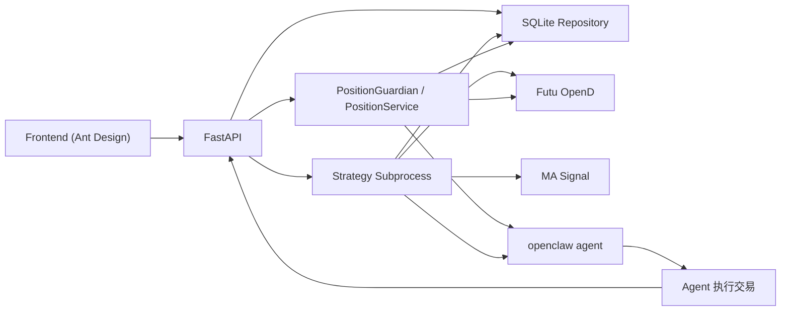

# Quant Trading System

基于富途 OpenD 的半自动量化交易系统。

当前实现不是“策略直接下单”，而是这条链路：

```text
OpenD 行情 -> Python 策略子进程 -> agent 信号 -> agent 执行下单 -> 成交确认 API -> PositionService -> SQLite 状态同步
```

系统支持两类运行形态：

- 实时策略运行
- 基于 OpenD 历史 K 线的回测

## 当前能力

- 使用 OpenD 订阅 `QUOTE`，并用日线样本计算实时 MA。
- 支持两种策略：
  - `single_position_ma`
  - `pyramiding_ma`
- 策略同时支持：
  - 金叉 `BUY`
  - 死叉 `SELL`
- `PositionMonitor` 只做固定兜底风控：
  - `-20%` 止损
  - `+30%` 止盈
- `PositionGuardian` 在主进程中持续监控账户级持仓，策略停止后仍可继续兜底风控。
- FastAPI 提供策略启动、停止、日志、成交确认、状态查询接口。
- SQLite 持久化：
  - 运行实例
  - 策略归属持仓
  - 账户级聚合持仓
  - 待确认订单
  - 成交历史
- 前端提供 Ant Design 管理页。

## 架构概览



关键点：

- 策略运行在子进程，不在 FastAPI 主进程内。
- 成交确认统一在主进程通过 `PositionService` 落库。
- 子进程不再消费确认命令，只从数据库读取策略持仓和待确认订单。
- 数据库是跨进程共享状态源，内存只是子进程内的热状态。

## 目录结构

```text
quant-trading-system/
├── backend/
│   ├── api/
│   │   └── app.py                     # FastAPI 服务
│   ├── cli/
│   │   └── run_strategy.py            # 实时策略子进程入口
│   ├── integrations/
│   │   ├── agent/
│   │   │   └── signal_sender.py       # agent 信号发送
│   │   └── futu/
│   │       └── quote_gateway.py       # OpenD 行情接入
│   ├── monitoring/
│   │   ├── guardian.py                # 主进程账户级持仓守护器
│   │   └── position_monitor.py        # 兼容/本地测试用持仓监控
│   ├── repositories/
│   │   ├── runtime_repository.py      # SQLite repository 层
│   │   └── sqlite.py                  # SQLite 连接封装
│   ├── services/
│   │   ├── position_service.py        # 成交确认与持仓落账服务
│   │   └── strategy_manager.py        # 策略注册/加载/参数构建
│   ├── strategies/
│   │   ├── runtime/
│   │   │   ├── realtime_runner.py     # 实时运行适配层
│   │   │   ├── single_position.py     # 单仓策略运行器
│   │   │   └── pyramiding.py          # 加仓策略运行器
│   │   └── signals/
│   │       └── ma_signal.py           # 纯信号层
│   ├── app.py                         # 兼容入口
│   └── logs/                          # 策略运行日志
├── backtest/
│   ├── data_provider.py               # 历史 K 线拉取
│   ├── engine.py                      # 回测引擎
│   ├── portfolio.py                   # 回测账户/持仓
│   ├── report.py                      # 回测结果输出
│   └── run_backtest.py                # 回测 CLI
├── docs/
│   ├── AGENT_API.md                   # agent 调用接口文档
│   └── STRATEGY_ARCHITECTURE.md       # 架构设计文档
├── frontend/                          # Ant Design 前端
└── tests/
    └── test_strategy_example.py       # 核心单测
```

## 运行模型

### 实时策略

1. FastAPI 启动一个策略子进程。
2. 子进程连接 OpenD，订阅：
   - `K_DAY` 用于初始化日线样本
   - `QUOTE` 用于盘中实时判断
3. 纯信号层根据“日线样本 + 最新报价”计算短期/长期 MA。
4. 策略发出 `BUY` / `SELL` 交易意图。
5. `signal_sender` 将意图发给 agent。
6. agent 实际交易成功后调用确认接口。
7. FastAPI 主进程中的 `PositionService` 直接更新 SQLite：
   - `strategy_positions`
   - `account_positions`
   - `pending_orders`
   - `executions`
8. 子进程在后续报价处理中从数据库读取最新持仓与 pending 状态。

### 回测

1. `data_provider.py` 通过 OpenD 历史 K 线接口拉数据。
2. 回测引擎复用 `ma_signal.py` 的同一套策略信号逻辑。
3. 引擎根据策略信号和风控逻辑生成交易记录与统计结果。

## SQLite 持久化模型

当前 SQLite 数据库保存 5 类核心状态：

- `strategy_runs`
  - 策略运行实例
- `strategy_positions`
  - 按 `run_id + code` 维护的策略归属持仓
- `account_positions`
  - 按 `account_id + code` 维护的账户级聚合持仓
- `pending_orders`
  - 待确认 `BUY` / `SELL`
- `executions`
  - 逐笔成交历史

这意味着：

- 同一标的可在多个策略实例下分别保留归属持仓
- 同时会在 `account_positions` 中聚合成账户总仓位
- 每次成交都会在 `executions` 里新增一条历史记录

## 环境要求

### 必需组件

- Python 3.9+
- 富途 OpenD
- `futu-api`
- Node.js 18+（前端需要）
- `openclaw` CLI（如果需要真实 agent 信号发送）

### Python 安装

```bash
python3 -m pip install -r requirements.txt
```

### 前端安装

```bash
cd frontend
npm install
```

## 启动方式

### 1. 启动 OpenD

确保 OpenD 已经启动并且行情登录正常。

### 2. 启动后端服务

```bash
python3 -m uvicorn backend.app:app --reload --port 8000
```

### 3. 启动前端

```bash
cd frontend
npm run dev
```

### 4. 直接运行实时策略

单仓策略：

```bash
python3 -m backend.cli.run_strategy \
  --strategy single_position_ma \
  --codes SZ.000001 \
  --short-ma 5 \
  --long-ma 20 \
  --order-qty 100
```

加仓策略：

```bash
python3 -m backend.cli.run_strategy \
  --strategy pyramiding_ma \
  --codes HK.03690 \
  --short-ma 5 \
  --long-ma 20 \
  --order-qty 100 \
  --max-position-per-stock 300
```

### 5. 运行回测

```bash
python3 backtest/run_backtest.py \
  --strategy single_position_ma \
  --codes SZ.000001 \
  --start 2026-03-01 \
  --end 2026-04-07 \
  --short-ma 5 \
  --long-ma 10
```

输出报告：

```bash
python3 backtest/run_backtest.py \
  --strategy pyramiding_ma \
  --codes SZ.000001 \
  --start 2026-01-01 \
  --end 2026-04-07 \
  --report-file backtest/report.json
```

## API 概览

主要接口：

- `GET /api/health`
- `GET /api/strategies`
- `GET /api/runs`
- `POST /api/runs`
- `POST /api/runs/{run_id}/stop`
- `GET /api/runs/{run_id}/logs`
- `GET /api/runs/{run_id}/state`
- `POST /api/runs/{run_id}/confirm-buy`
- `POST /api/runs/{run_id}/confirm-sell`
- `POST /api/accounts/{account_id}/confirm-sell`

详细请求体和返回示例见：

- [AGENT_API.md](/Users/mubinlai/code/quant-trading-system/docs/AGENT_API.md)

## 成交确认说明

### 买入确认

agent 买入成功后调用：

```http
POST /api/runs/{run_id}/confirm-buy
```

请求体示例：

```json
{
  "code": "HK.03690",
  "qty": 100,
  "entryPrice": 85.2,
  "reason": "agent成交确认"
}
```

### 卖出确认

策略发出的卖出意图，agent 成交后调用：

```http
POST /api/runs/{run_id}/confirm-sell
```

请求体示例：

```json
{
  "code": "HK.03690",
  "qty": 100,
  "exitPrice": 91.5,
  "reason": "agent卖出成交确认"
}
```

### guardian 账户级卖出确认

如果卖出信号来自 guardian 兜底风控，则不使用 `run_id`，而是按账户级接口确认：

```http
POST /api/accounts/{account_id}/confirm-sell
```

请求体示例：

```json
{
  "code": "HK.03690",
  "qty": 300,
  "exitPrice": 91.5,
  "reason": "guardian stop sell"
}
```

### 状态核对

确认后可通过：

```http
GET /api/runs/{run_id}/state
```

检查三类结果：

- `positions`
- `accountPositions`
- `pendingOrders`
- `executions`

## 文档

- [策略架构设计](/Users/mubinlai/code/quant-trading-system/docs/STRATEGY_ARCHITECTURE.md)
- [Agent 接口文档](/Users/mubinlai/code/quant-trading-system/docs/AGENT_API.md)

## 验证

单测：

```bash
python3 -m unittest -v tests/test_strategy_example.py
```

语法检查：

```bash
python3 -m compileall backend backtest tests
```

## 注意事项

- 当前是单机 SQLite 方案，适合当前开发和单节点运行。
- `backend/data/runtime.sqlite3` 是运行时数据库，不建议提交。
- 正式兜底风控由主进程中的 `PositionGuardian` 基于 `account_positions` 执行。
- API 不直接修改子进程对象，成交确认统一通过主进程 `PositionService` 落库。
- 如果 agent 执行了买卖但没有回调确认接口，数据库状态不会更新。
