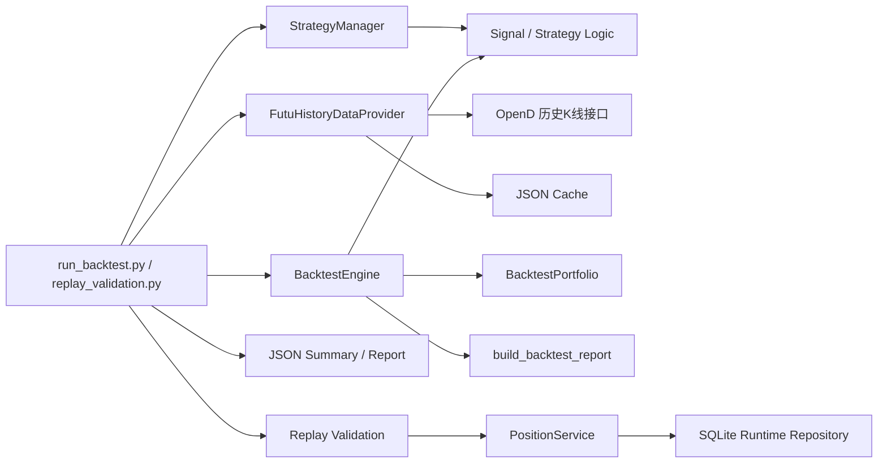
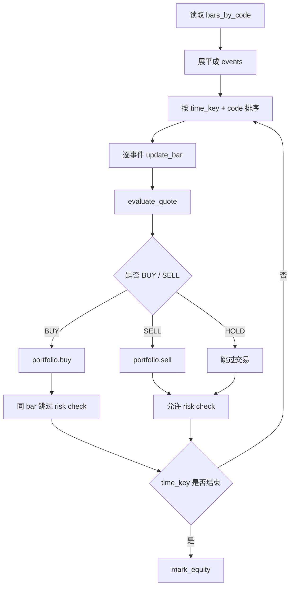
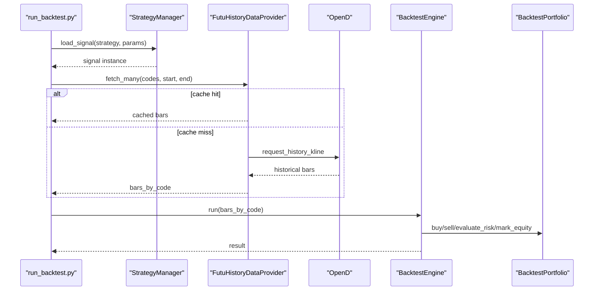
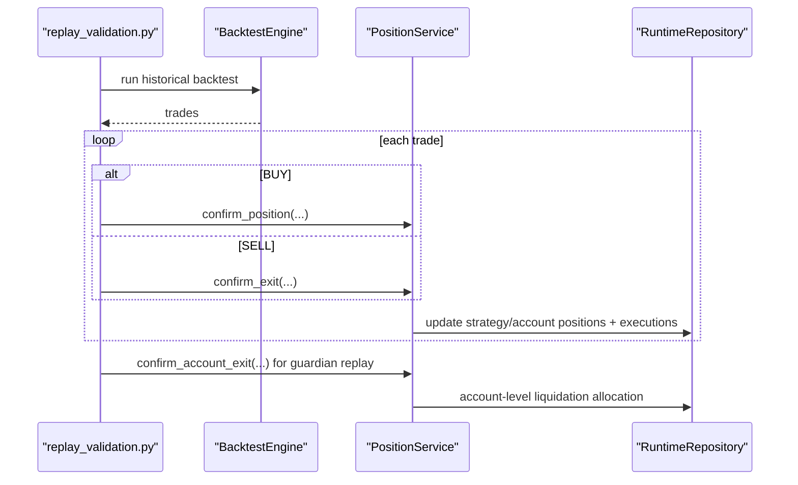

# 回测模块设计文档

## 1. 文档范围

本文档描述当前项目中回测模块的真实设计与运行方式，覆盖以下内容：

- 历史数据获取
- 信号层如何复用
- 回测引擎事件循环
- 账户与持仓模型
- 指标汇总与图表输出
- 回测结果到业务流程回放的验证链路
- 已知限制与后续演进方向

核心实现文件：

- [/Users/mubinlai/code/quant-trading-system/backtest/data_provider.py](/Users/mubinlai/code/quant-trading-system/backtest/data_provider.py)
- [/Users/mubinlai/code/quant-trading-system/backtest/engine.py](/Users/mubinlai/code/quant-trading-system/backtest/engine.py)
- [/Users/mubinlai/code/quant-trading-system/backtest/portfolio.py](/Users/mubinlai/code/quant-trading-system/backtest/portfolio.py)
- [/Users/mubinlai/code/quant-trading-system/backtest/report.py](/Users/mubinlai/code/quant-trading-system/backtest/report.py)
- [/Users/mubinlai/code/quant-trading-system/backtest/run_backtest.py](/Users/mubinlai/code/quant-trading-system/backtest/run_backtest.py)
- [/Users/mubinlai/code/quant-trading-system/backtest/replay_validation.py](/Users/mubinlai/code/quant-trading-system/backtest/replay_validation.py)
- [/Users/mubinlai/code/quant-trading-system/backend/services/strategy_manager.py](/Users/mubinlai/code/quant-trading-system/backend/services/strategy_manager.py)

## 2. 设计目标

当前回测模块主要服务三个目标：

1. 用同一套 `signal / strategy logic` 复用实时策略判断。
2. 在历史日线数据上快速评估策略收益、回撤和交易行为。
3. 把回测结果继续送入“业务流程回放”，验证持仓登记、账户聚合和 guardian 兜底卖出的闭环。

这意味着当前回测模块不是单纯的收益分析器，而是：

- `策略回测器`
- `流程验证前置阶段`

## 3. 总体架构

回测部分可以拆成两段：

1. `run_backtest.py`
   只做历史回测。

2. `replay_validation.py`
   先跑历史回测，再把交易事件回放到主进程的持仓服务中，验证业务账务闭环。

## 4. 模块职责

### 4.1 FutuHistoryDataProvider

文件：
- [/Users/mubinlai/code/quant-trading-system/backtest/data_provider.py](/Users/mubinlai/code/quant-trading-system/backtest/data_provider.py)

职责：

1. 使用 OpenD 的 `request_history_kline` 拉取历史 K 线。
2. 支持分页拉取完整历史区间。
3. 将结果缓存到本地 JSON 文件，避免重复请求。

关键设计：

- 默认使用：
  - `KLType.K_DAY`
  - `AuType.QFQ`
- 缓存路径按：
  - `code`
  - `start`
  - `end`
  - `ktype`
  - `autype`
 组合生成。

这意味着相同参数下重复回测时，优先命中缓存。

### 4.2 StrategyManager 与 Signal 层复用

文件：
- [/Users/mubinlai/code/quant-trading-system/backend/services/strategy_manager.py](/Users/mubinlai/code/quant-trading-system/backend/services/strategy_manager.py)

职责：

1. 注册可回测策略。
2. 提供统一参数元数据。
3. 为回测加载纯信号实例。

当前回测支持的策略包括：

- `single_position_ma`
- `pyramiding_ma`
- `rsi_reversion`
- `bollinger_reversion`
- `macd_trend`
- `donchian_breakout`

不支持当前回测模型的策略会在 metadata 中标记：

- `supports_backtest = false`

例如：
- `intraday_breakout_test`

其原因是当前回测引擎是基于日线收盘驱动，不适合日内纯报价策略。

### 4.3 BacktestEngine

文件：
- [/Users/mubinlai/code/quant-trading-system/backtest/engine.py](/Users/mubinlai/code/quant-trading-system/backtest/engine.py)

职责：

1. 把多标的历史 bar 展平成统一事件流。
2. 逐事件调用 signal 层产生 `BUY / SELL / HOLD`。
3. 调用组合账户模型执行买卖。
4. 做日线级别的止损止盈检查。
5. 生成权益曲线。

当前处理流程：

### 4.4 BacktestPortfolio

文件：
- [/Users/mubinlai/code/quant-trading-system/backtest/portfolio.py](/Users/mubinlai/code/quant-trading-system/backtest/portfolio.py)

职责：

1. 管理现金。
2. 管理当前持仓。
3. 记录交易明细。
4. 计算权益曲线。
5. 提供简化止损止盈检查。

当前持仓模型字段：

- `qty`
- `entry`
- `cost_basis_total`
- `cost_basis_per_share`
- `entry_time`
- `stop`
- `profit`
- `stop_pct`
- `profit_pct`
- `reason`

关键说明：

- 当前模型支持多次买入后的平均持仓成本。
- `realized_pnl` 现在使用 `cost_basis_total` 计算，因此已包含买入佣金，不会把接近保本的单误判成盈利。
- 当前 `sell()` 仍然只支持全平，不支持部分卖出。

### 4.5 build_backtest_report

文件：
- [/Users/mubinlai/code/quant-trading-system/backtest/report.py](/Users/mubinlai/code/quant-trading-system/backtest/report.py)

职责：

1. 汇总收益率。
2. 统计交易次数和已平仓次数。
3. 基于权益曲线计算最大回撤。
4. 基于 `SELL` 交易统计胜率。
5. 输出未平仓仓位快照。

当前输出字段：

- `strategy`
- `initial_cash`
- `final_equity`
- `return_pct`
- `trade_count`
- `closed_trade_count`
- `win_rate`
- `max_drawdown_pct`
- `open_positions`

## 5. 数据流设计

### 5.1 历史回测数据流

### 5.2 流程回放数据流

这个阶段不是重新跑策略，而是把回测产生的 `BUY / SELL` 交易事件回放到主进程账务层，验证：

- `strategy_positions`
- `account_positions`
- `pending_orders`
- `executions`

是否一致。

## 6. 当前支持的策略类型

### 6.1 均线类

文件：
- [/Users/mubinlai/code/quant-trading-system/backend/strategies/signals/ma_signal.py](/Users/mubinlai/code/quant-trading-system/backend/strategies/signals/ma_signal.py)

支持：

- `single_position_ma`
- `pyramiding_ma`

特点：

- 依赖历史日线初始化。
- 用日线序列和最新价格计算盘中实时 MA。
- 当前回测按日线 close 驱动，等效为“收盘信号”。

### 6.2 RSI 反转

文件：
- [/Users/mubinlai/code/quant-trading-system/backend/strategies/signals/indicator_signals.py](/Users/mubinlai/code/quant-trading-system/backend/strategies/signals/indicator_signals.py)

策略：
- `rsi_reversion`

逻辑：

- RSI 从超卖区下方向上回穿阈值时买入。
- RSI 进入超买区时卖出。

### 6.3 布林带反转

策略：
- `bollinger_reversion`

逻辑：

- 跌破下轨后重新站回通道内买入。
- 回到中轨附近时卖出。

### 6.4 MACD 趋势

策略：
- `macd_trend`

逻辑：

- MACD 金叉买入。
- MACD 死叉卖出。

### 6.5 唐奇安突破

策略：
- `donchian_breakout`

逻辑：

- 突破前 N 日高点买入。
- 跌破退出通道卖出。

## 7. 参数装配设计

当前参数装配统一由：

- [/Users/mubinlai/code/quant-trading-system/backend/services/strategy_manager.py](/Users/mubinlai/code/quant-trading-system/backend/services/strategy_manager.py)

中的以下函数完成：

- `resolve_strategy_params`
- `strategy_supports_backtest`

意义：

1. 回测 CLI 不再单独维护一套 MA 专用参数。
2. 回放验证也复用同一套 metadata。
3. 前端回测页和策略管理页都基于同一份 `param_fields` 渲染。

当前 `resolve_strategy_params` 会做基础校验：

- `codes` 转换为 list
- `number` 字段转换为数值
- 校验 `min` / `max`
- `text` 去除空白

这是为了避免错误参数一路传进 signal 实例化后才崩溃。

## 8. 回测结果输出

### 8.1 `run_backtest.py`

输出：

- 控制台 summary
- 可选 JSON 报告文件

适用场景：

- 快速看策略历史表现
- 做参数试验

### 8.2 `replay_validation.py`

输出：

- `backtest.summary`
- `backtest.trades`
- `workflowReplay`
- `guardianReplay`
- `chart`

适用场景：

- 验证“策略信号 -> 账务落库 -> guardian 账户级退出”闭环

当前前端“回测验证页”实际消费的就是这份结构化输出。

## 9. 当前回测模型的假设

### 9.1 时间粒度假设

当前回测是日线 close 驱动模型。

含义：

- 每根 bar 的信号基于该 bar close 评估。
- 买卖执行价格也是基于该 bar close 加减滑点。
- 没有模拟日内逐笔路径。

### 9.2 止损止盈假设

当前风险检查使用的是：

- bar close 价格

不是：

- 当日 high / low 的触发式撮合

这是一种行业常见的简化方式，适合当前的日线回测模型，但不适合做严格的 intraday stop simulation。

### 9.3 同 bar 行为假设

当前已经修正为：

- 如果本 bar 刚刚买入
- 同一 bar 不再立即触发止损止盈

这是为了避免不真实的“先买后止损”结果。

### 9.4 持仓模型假设

当前模型支持：

- 多次买入叠加
- 平均成本
- 全部卖出

当前模型不支持：

- 部分卖出
- FIFO/LIFO 明细成本
- 分批止盈

## 10. 已知限制

### 10.1 部分卖出尚未支持

当前 [portfolio.py](/Users/mubinlai/code/quant-trading-system/backtest/portfolio.py) 的 `sell()` 默认卖出全部持仓。

影响：

- 当前策略如果都按全平退出，没有问题。
- 若后续引入分批止盈、减仓或动态再平衡，则必须先重构成本法。

### 10.2 胜率口径是“按已平仓交易”

当前 `win_rate` 只基于：

- `SELL` 交易的 `realized_pnl > 0`

因此它反映的是：

- 已完成的一轮持仓结果

而不是：

- 单笔加仓的独立胜率

### 10.3 多标的同日资金分配未单独建模

当前事件顺序按：

- `time_key`
- `code`

排序。

这意味着：

- 同一天多个标的同时触发 `BUY`
- 若资金不足
- 谁先成交由 `code` 顺序决定

当前把它视为已知限制，而不是现时 bug。后续如果需要严肃处理多标的组合分配，应引入显式的 allocation policy。

### 10.4 当前回放验证偏“成交事件驱动”

`replay_validation.py` 不是对 OpenD 推送做逐 tick 仿真，而是：

- 用回测产生的交易事件直接回放持仓登记流程

优点：

- 快
- 稳
- 适合验证账务和 guardian 链路

缺点：

- 不能替代真正的 end-to-end tick replay

## 11. 为什么回测与回放要分成两层

这是当前设计里很关键的一点。

### 11.1 回测回答的问题

回测主要回答：

- 这个策略历史上会不会产生合理买卖点？
- 收益、回撤、胜率怎么样？

### 11.2 回放回答的问题

回放主要回答：

- 一旦有成交事件，数据库账务会不会记对？
- `strategy_positions` 与 `account_positions` 是否一致？
- guardian 账户级卖出能不能正确分摊回策略持仓？

所以：

- 回测 = 策略逻辑验证
- 回放 = 业务闭环验证

两者职责不同，不能互相替代。

## 12. 与实时系统的关系

当前设计下：

- 实时系统和回测系统共享 signal 层
- 不共享行情驱动方式
- 不共享 broker 执行方式

共享的部分：

- signal / strategy logic
- 参数元数据
- 持仓服务与回放验证链路

不共享的部分：

- OpenD 实时报价订阅
- agent 执行下单
- broker 回报驱动结算

这使得策略判断尽量一致，但不会把实时系统的复杂性全部复制进回测引擎。

## 13. 后续演进建议

按优先级排序，建议后续这样演进：

1. 支持部分卖出
   - 重构 `BacktestPortfolio`
   - 引入 FIFO / 平均成本法的明确实现

2. 改进回测统计口径
   - 更细的 trade attribution
   - 更准确的加仓/减仓胜率统计

3. 引入明确的组合分配策略
   - 解决多标的同日现金竞争问题

4. 如果需要更严格的风险模拟
   - 改为使用当日 high / low 做 stop/profit 触发近似

5. 如果需要日内策略回测
   - 单独做分钟级或 tick 级回测引擎
   - 不建议继续复用当前日线 close 驱动引擎

## 14. 总结

当前回测模块的定位很明确：

- 它不是高频撮合器
- 也不是完整的实盘仿真系统
- 它是一个基于日线历史数据的策略验证引擎
- 同时又向下游提供业务流程回放能力

当前最有价值的设计点有三个：

1. 回测与实时共享同一套 signal 逻辑。
2. 回测结果可以直接进入持仓与账户级流程验证。
3. 回测参数、前端表单和策略注册都已经统一到同一份 metadata。

这意味着后续你继续加策略时：

- 默认只需要新增 signal 类
- 注册 metadata
- 如果支持日线回测，就能自动进入当前回测体系

