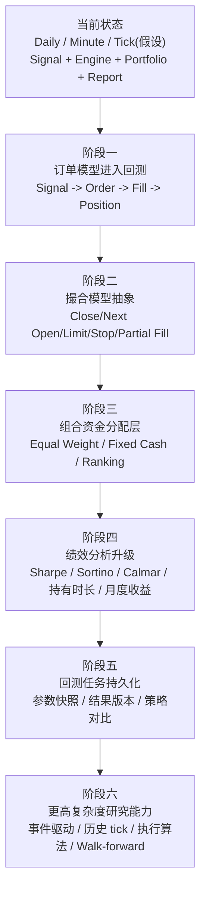

# 回测模块专业化演进文档

## 1. 文档目标

本文档描述当前项目回测模块的完成状态，以及在现有基础上如何向更专业的回测系统演进。

这里的“专业化”不是指一次性引入所有复杂能力，而是按收益最高、风险最低的顺序，逐步补齐：

- 更真实的撮合语义
- 更清晰的订单模型
- 更完整的组合层资金分配
- 更系统的绩效分析
- 更稳定的结果持久化与对比能力

核心前提是：

- 当前项目已经有可用的日线、分钟级、tick 假设引擎
- 当前项目已经有 signal / engine / portfolio / report 的基本分层
- 当前项目已经有回测结果回放验证链路

因此后续演进应以“收敛和增强”为主，而不是推翻重写。

## 2. 当前能力基线

当前回测模块已经完成的主要能力如下。

### 2.1 数据层

- 历史 K 线通过 OpenD 获取
- 支持：
  - `K_DAY`
  - `K_1M`
- tick 引擎已设计，但真实历史 tick 数据依赖假设接口
- 本地 JSON cache 已存在

对应文件：

- [/Users/mubinlai/code/quant-trading-system/backtest/data_provider.py](/Users/mubinlai/code/quant-trading-system/backtest/data_provider.py)

### 2.2 引擎层

当前已有三类引擎：

- 日线引擎
- 分钟级引擎
- tick 假设引擎

对应文件：

- [/Users/mubinlai/code/quant-trading-system/backtest/engine.py](/Users/mubinlai/code/quant-trading-system/backtest/engine.py)

### 2.3 账户层

当前 `BacktestPortfolio` 已支持：

- 现金管理
- 当前持仓
- 买入/卖出落账
- 简化止损止盈
- 权益曲线记录
- 买入佣金计入持仓成本

对应文件：

- [/Users/mubinlai/code/quant-trading-system/backtest/portfolio.py](/Users/mubinlai/code/quant-trading-system/backtest/portfolio.py)

### 2.4 报表层

当前已支持：

- 收益率
- 最大回撤
- 交易数量
- 胜率
- 交易明细
- 前端摘要展示

对应文件：

- [/Users/mubinlai/code/quant-trading-system/backtest/report.py](/Users/mubinlai/code/quant-trading-system/backtest/report.py)
- [/Users/mubinlai/code/quant-trading-system/frontend/src/BacktestPage.jsx](/Users/mubinlai/code/quant-trading-system/frontend/src/BacktestPage.jsx)

### 2.5 回放验证层

当前已支持：

- 把回测产生的交易事件回放到业务落账链路
- 验证：
  - `strategy_positions`
  - `account_positions`
  - `executions`
  - `pending_orders`

对应文件：

- [/Users/mubinlai/code/quant-trading-system/backtest/replay_validation.py](/Users/mubinlai/code/quant-trading-system/backtest/replay_validation.py)

## 3. 当前专业边界

虽然当前模块已经可用，但它仍然更接近：

- `可扩展原型`

而不是：

- `专业研究型回测平台`

当前主要边界有：

1. 回测里仍然是“交易结果导向”，不是“订单生命周期导向”
2. 组合层资金分配规则尚未明确建模
3. 部分卖出与复杂成本法尚未全面支持
4. 绩效分析仍偏摘要化
5. 回测结果尚未形成正式的任务/版本化体系

## 4. 演进原则

后续演进建议遵循以下原则：

1. 与实时交易语义收敛
- 回测中的 `signal / order / fill / position` 尽量与实盘保持相同概念边界

2. 先补“正确性”，再补“复杂性”
- 优先修补会影响回测结论正确性的部分
- 再做更复杂的特性

3. 先补“组合层”，再补“高频层”
- 多标的资金分配比订单簿模拟更早产生业务价值

4. 逐层引入，不一次性做大
- 每一阶段都应形成可运行、可验证的稳定版本

## 5. 技术演进流程图

## 6. 分阶段演进设计

## 6.1 阶段一：回测订单模型

### 目标

让回测不再只有：

- `trade`

而是明确区分：

- `signal`
- `order`
- `fill`
- `position`

### 为什么优先做

这是实盘与回测语义统一的第一步。

当前实盘已经有：

- `trade_orders`
- `trade_deals`
- `executions`
- `positions`

而回测里仍然偏向直接：

- 信号触发后立刻买/卖

如果不补这一层，后面很多专业能力都很难做：

- 部分成交
- 超时未成交
- 撤单
- 改价

### 建议设计

新增概念：

- `BacktestOrder`
- `BacktestFill`
- `BacktestExecutionLedger`

回测引擎流程由：

- `signal -> portfolio.buy/sell`

演进为：

- `signal -> create order -> matching -> fill -> portfolio apply fill`

### 对现有代码的影响

主要影响：

- [/Users/mubinlai/code/quant-trading-system/backtest/engine.py](/Users/mubinlai/code/quant-trading-system/backtest/engine.py)
- [/Users/mubinlai/code/quant-trading-system/backtest/portfolio.py](/Users/mubinlai/code/quant-trading-system/backtest/portfolio.py)

### 预期收益

- 回测与实盘订单模型收敛
- 更容易解释“为什么成交”
- 为部分成交和撤单奠定基础

## 6.2 阶段二：撮合模型抽象

### 目标

把当前简化成交模型抽成可配置的 matching policy。

### 当前问题

现在的成交模型仍然偏单一：

- 日线近似成交
- 分钟线近似成交
- tick 驱动仍然很简化

### 建议支持的撮合模式

至少支持：

- `close_fill`
- `next_open_fill`
- `limit_fill`
- `stop_fill`
- `partial_fill`

### 建议接口

例如：

- `FillModel`
- `BarFillModel`
- `TickFillModel`

由引擎在处理订单时调用 fill model，而不是自己直接决定成交。

### 预期收益

- 同一策略可以比较不同撮合假设
- 回测结论更可解释
- 可以更接近真实执行结果

## 6.3 阶段三：组合资金分配层

### 目标

解决多标的同时触发时，资金使用与持仓分配问题。

### 当前问题

当前引擎更偏“单标的或少量标的逐事件处理”。

在以下场景里会遇到问题：

- 同一时间多个 BUY
- 现金不足
- 需要排序选股
- 需要限制最大同时持仓数

### 建议设计

引入独立的 allocation policy，例如：

- `fixed_cash_per_trade`
- `equal_weight`
- `top_n_ranked`
- `max_concurrent_positions`

不要把这些规则散落在 `engine.py` 里。

### 预期收益

- 多标的回测结果更稳定
- 为横截面/轮动策略铺路

## 6.4 阶段四：绩效分析升级

### 目标

从“摘要报表”升级到“研究报表”。

### 当前已有

- 收益率
- 胜率
- 最大回撤
- 交易次数

### 建议补充

- 年化收益
- Sharpe
- Sortino
- Calmar
- Profit Factor
- 平均持有时长
- 月度收益分布
- 收益回撤图
- 单笔交易盈亏分布

### 代码影响

主要落在：

- [/Users/mubinlai/code/quant-trading-system/backtest/report.py](/Users/mubinlai/code/quant-trading-system/backtest/report.py)
- 前端回测页

### 预期收益

- 更适合比较不同参数与不同策略
- 更接近研究/审计需求

## 6.5 阶段五：回测任务持久化

### 目标

让回测成为正式资产，而不是临时运行结果。

### 当前问题

现在回测更多是：

- 即时跑
- 即时看
- 即时覆盖

缺少：

- 任务记录
- 参数快照
- 结果版本
- 历史对比

### 建议设计

新增持久化模型：

- `backtest_runs`
- `backtest_run_params`
- `backtest_run_metrics`
- `backtest_run_trades`

### 预期收益

- 支持横向比较
- 支持前端历史回测列表
- 支持复盘与审计

## 6.6 阶段六：更高复杂度研究能力

### 目标

支持更复杂的策略研究，而不是只做 bar-based directional strategy。

### 可能扩展方向

- 事件驱动策略
- 历史 tick 研究
- 执行算法回测
- Walk-forward optimization
- 参数搜索
- Monte Carlo

### 说明

这一阶段不建议过早进入。  
它应建立在前五阶段已经稳定后再做。

## 7. 推荐优先级

基于当前项目状态，建议优先级如下：

1. 回测订单模型
2. 撮合模型抽象
3. 组合资金分配层
4. 绩效分析升级
5. 回测任务持久化
6. 更高复杂度研究能力

这是因为：

- 前三项直接决定回测结论是否可信
- 后三项主要决定研究效率和产品化程度

## 8. 与现有架构的衔接建议

当前系统已经有实时交易的正式模型：

- `trade_orders`
- `trade_deals`
- `executions`
- `strategy_positions`
- `account_positions`

回测模块的专业化演进，建议尽量向这套实盘模型收敛。

推荐方向：

- 回测也有 `orders`
- 回测也有 `fills`
- 回测结果可回放进 `PositionService`
- 最终形成“研究模型”和“生产模型”概念一致

这样可以减少：

- 回测逻辑和实盘逻辑两套完全不同的问题

## 9. 当前结论

基于现有完成内容，回测模块已经具备：

- 日线策略回测
- 分钟级日内策略回测
- tick 假设引擎
- 结果回放验证链路

下一阶段不需要推翻重做。  
更合理的方式是：

- 以订单模型为中心
- 逐步增强撮合、组合和报表
- 最终与实盘交易模型收敛

一句话总结：

当前回测模块已经跨过“能不能跑”的阶段，下一步的专业化重点应放在“成交语义、组合语义和结果管理”上。  
