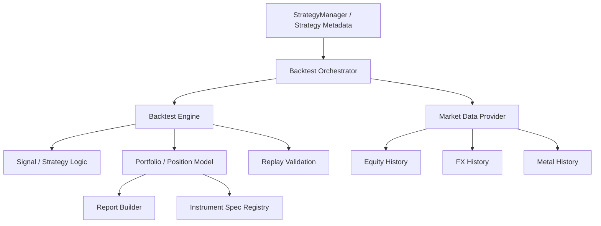
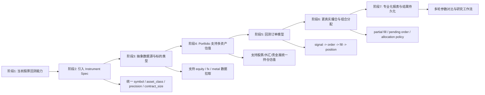

# 回测模块需求与概要设计

## 1. 文档目的

本文档基于当前项目已有的回测实现，整理：

- 当前回测模块已完成的功能边界
- 面向后续专业化演进的需求
- 回测模块的概要设计
- 外汇与贵金属标的支持的新增需求与设计方向

本文档是需求与概要设计，不替代现有实现说明。实现细节仍以：

- [/Users/mubinlai/code/quant-trading-system/docs/BACKTEST_ARCHITECTURE.md](/Users/mubinlai/code/quant-trading-system/docs/BACKTEST_ARCHITECTURE.md)

为准。

---

## 2. 建设目标

回测模块当前不只是“算收益率”，而是承担三类职责：

1. 复用实时策略的 `signal / strategy logic`
2. 在历史数据上验证策略交易行为与账户表现
3. 通过 `replay_validation` 验证回测交易事件能否在真实业务账本中闭环

后续演进目标也应保持这三个方向一致：

- 策略逻辑复用
- 回测真实性增强
- 与真实交易账本收敛

---

## 3. 当前范围

### 3.1 已支持的数据粒度

- 日线回测
- 分钟级回测
- Tick 级回测引擎框架

说明：

- `tick` 引擎已实现，但依赖假设存在的历史逐笔接口
- 当前真实可稳定使用的是：
  - `daily`
  - `minute`

### 3.2 已支持的策略类型

当前回测已覆盖：

- 均线策略
  - `single_position_ma`
  - `pyramiding_ma`
- 主流日线指标策略
  - `rsi_reversion`
  - `bollinger_reversion`
  - `macd_trend`
  - `donchian_breakout`
- 日内策略
  - `intraday_breakout_test`

### 3.3 已支持的业务能力

- 基于历史行情驱动 signal 层
- 账户资金与持仓模拟
- 基础手续费与滑点
- 止损 / 止盈兜底检查
- 权益曲线与摘要报告
- 回测结果回放到主进程账本

---

## 4. 当前功能模块

### 4.1 数据提供层

文件：

- [/Users/mubinlai/code/quant-trading-system/backtest/data_provider.py](/Users/mubinlai/code/quant-trading-system/backtest/data_provider.py)

职责：

- 通过 OpenD 拉历史 K 线
- 本地 JSON 缓存
- 提供多标的批量拉取
- 提供 tick 假设接口封装

当前边界：

- 主数据源仍是 FUTU / OpenD
- 数据缓存是文件级，不是数据仓库级

### 4.2 引擎层

文件：

- [/Users/mubinlai/code/quant-trading-system/backtest/engine.py](/Users/mubinlai/code/quant-trading-system/backtest/engine.py)

当前包含：

- `BacktestEngine`
- `MinuteBacktestEngine`
- `TickBacktestEngine`

职责：

- 把历史数据转成事件流
- 驱动策略 signal
- 调用 portfolio 进行交易落账
- 输出回测结果

### 4.3 账户与持仓层

文件：

- [/Users/mubinlai/code/quant-trading-system/backtest/portfolio.py](/Users/mubinlai/code/quant-trading-system/backtest/portfolio.py)

职责：

- 管理现金
- 管理持仓
- 执行买卖
- 计算已实现盈亏
- 记录权益曲线

当前边界：

- 当前仍偏“轻撮合模型”
- 主要支持全平，不支持完整部分卖出成本法

### 4.4 报告层

文件：

- [/Users/mubinlai/code/quant-trading-system/backtest/report.py](/Users/mubinlai/code/quant-trading-system/backtest/report.py)

职责：

- 生成摘要
- 计算收益、回撤、胜率等核心指标

### 4.5 回放验证层

文件：

- [/Users/mubinlai/code/quant-trading-system/backtest/replay_validation.py](/Users/mubinlai/code/quant-trading-system/backtest/replay_validation.py)

职责：

- 把回测事件转换成业务流程事件
- 回放到 `PositionService`
- 验证：
  - `strategy_positions`
  - `account_positions`
  - `executions`
  - `pending_orders`

### 4.6 策略元数据层

文件：

- [/Users/mubinlai/code/quant-trading-system/backend/services/strategy_manager.py](/Users/mubinlai/code/quant-trading-system/backend/services/strategy_manager.py)

职责：

- 注册回测策略
- 提供默认参数与参数 schema
- 指定默认回测引擎和 `ktype`

---

## 5. 当前主要问题与设计缺口

### 5.1 撮合语义仍偏简化

当前回测更接近：

- signal 生成
- 按 bar 近似成交

还不是完整订单驱动模型。

缺口：

- 缺少正式的回测订单对象
- 缺少挂单、撤单、改价、部分成交模型

### 5.2 回测账户模型与实盘账本仍未完全同构

实盘侧已经有：

- `trade_orders`
- `trade_deals`
- `executions`
- `strategy_positions`
- `account_positions`

回测侧当前主要还是：

- `trades`
- `positions`

缺口：

- 语义统一还不够
- 回测结果与真实订单生命周期之间还缺一层桥

### 5.3 多标的组合分配能力不足

当前引擎已能跑多标的，但缺少正式的组合资金分配规则：

- 同时间多信号冲突
- 现金不足时的优先级
- 等权分配 / 固定金额分配

当前属于已知限制，不是当前主流程 bug。

### 5.4 标的范围偏窄

当前 symbol 设计主要围绕：

- `HK.xxx`
- `US.xxx`
- `SH.xxx`
- `SZ.xxx`

还没有面向：

- 外汇
- 贵金属

的正式产品化设计。

---

## 6. 新增需求：支持外汇与贵金属回测

## 6.1 目标

在现有回测模块中新增支持以下资产类别：

- 外汇
- 贵金属

目标不是只让代码“接受一个新 symbol”，而是要在回测层正确表达这些资产的交易语义。

## 6.2 新需求范围

### 功能需求

1. 支持新的标的类型识别
2. 支持新标的历史数据拉取
3. 支持新标的交易参数建模
4. 支持新标的回测账户估值
5. 支持在报告中按资产类别展示结果

### 非功能需求

1. 不破坏当前股票回测
2. 保持 signal 层尽量复用
3. 不把资产类别差异硬编码进所有策略

## 6.3 新增资产类别需要补的能力

### A. Instrument Spec

建议新增一层统一的标的规格模型，例如：

- `asset_class`
- `quote_currency`
- `price_precision`
- `min_trade_unit`
- `contract_size`
- `tick_size`
- `trading_calendar`
- `session_timezone`

原因：

- 股票、外汇、贵金属的单位体系不同
- 不能再只用 `qty + price` 的股票思维处理所有资产

### B. Symbol Normalization

建议引入统一 symbol 解析层，例如：

- `HK.03690`
- `FX.EURUSD`
- `METAL.XAUUSD`
- `METAL.XAGUSD`

这样回测、实盘、数据拉取都能共用一套 symbol 规范。

### C. 估值与盈亏计算

外汇与贵金属至少要明确：

- 按什么单位成交
- 盈亏是按手、按合约、还是按基础货币数量
- 手续费和点差如何进入成本

当前 portfolio 默认是股票式模型：

- `qty * price`

未来需要演进成：

- `position_qty * contract_size * price`

或由 instrument spec 决定估值方式。

### D. 交易日历与时间粒度

外汇与贵金属的 session 语义通常不同于股票：

- 外汇接近 24x5
- 贵金属可能有特定交易时段

因此回测引擎需要从“按股票市场日历默认运行”升级为“按 instrument calendar 运行”。

---

## 7. 概要设计

## 7.1 分层设计



### 设计原则

1. signal 层尽量资产无关
2. 资产差异集中在：
   - data provider
   - instrument spec
   - portfolio valuation
3. 报表层消费统一结果结构

## 7.2 新增模块建议

### A. InstrumentSpecRegistry

建议新增文件：

- `backtest/instruments.py`

职责：

- 定义资产类别
- 定义 symbol 规范
- 定义估值规格
- 提供 calendar / precision / unit 查询

示例结构：

```python
{
  "HK.03690": {"asset_class": "equity", ...},
  "FX.EURUSD": {"asset_class": "fx", ...},
  "METAL.XAUUSD": {"asset_class": "metal", ...},
}
```

### B. MarketDataProvider 抽象升级

当前：

- `FutuHistoryDataProvider`

建议演进为：

- `BacktestDataProvider` 抽象接口
- `FutuHistoryDataProvider` 作为一个实现

未来外汇/贵金属如仍来自 FUTU，则继续复用；如来自别的数据源，也可平滑新增 provider。

### C. Portfolio 资产模型升级

建议让 `BacktestPortfolio` 接收 `instrument_spec`，由它决定：

- 成交金额
- 合约价值
- 手续费
- 估值方式

这样股票、外汇、金属就不需要三套独立 portfolio。

---

## 8. 演进流程图



---

## 9. 分阶段实施建议

## 阶段 1：标的层抽象

目标：

- 不改动策略逻辑，先把 symbol 和资产类别抽象出来

建议产出：

- `backtest/instruments.py`
- `normalize_symbol()`
- `resolve_instrument_spec()`

## 阶段 2：外汇 / 贵金属数据接入

目标：

- 在 data provider 层支持新标的拉数

建议产出：

- 新的 symbol 规则
- provider 对 FX / METAL 的支持
- 新缓存键规范

## 阶段 3：portfolio 多资产估值

目标：

- 支持股票、外汇、贵金属共用一套组合层

建议产出：

- instrument-aware 的买卖与估值逻辑
- 更清晰的成本与单位模型

## 阶段 4：订单模型

目标：

- 回测结果向实盘语义收敛

建议产出：

- 回测订单对象
- fill 对象
- 与 `trade_orders / executions` 更接近的结果结构

## 阶段 5：组合与报表增强

目标：

- 让回测模块从“单策略验证器”升级为“研究工具”

建议产出：

- 组合分配规则
- 更专业绩效指标
- 多资产对比报告

---

## 10. 设计结论

基于当前实现，回测模块已经具备：

- 策略逻辑复用
- 日线 / 分钟 / tick 三层引擎框架
- 账户与持仓模拟
- 与业务账本回放联通

后续专业化演进，最重要的不是立刻引入更复杂的回测框架，而是先补齐：

1. 标的规格抽象
2. 多资产数据接入
3. 多资产估值模型
4. 回测订单语义
5. 组合分配与专业报表

对于你新增的需求，外汇和贵金属支持不应作为“在现有股票逻辑上打补丁”，而应作为：

**推动回测模块从股票专用原型，演进为多资产回测平台的第一步。**
