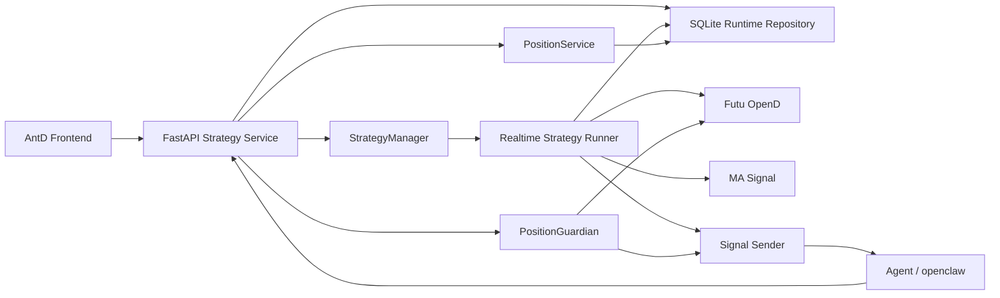
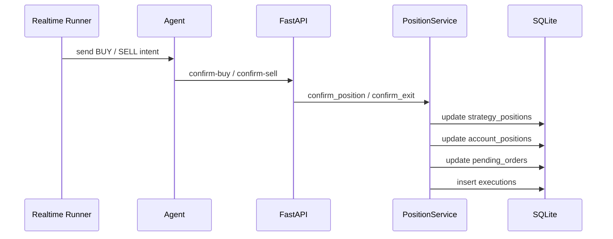
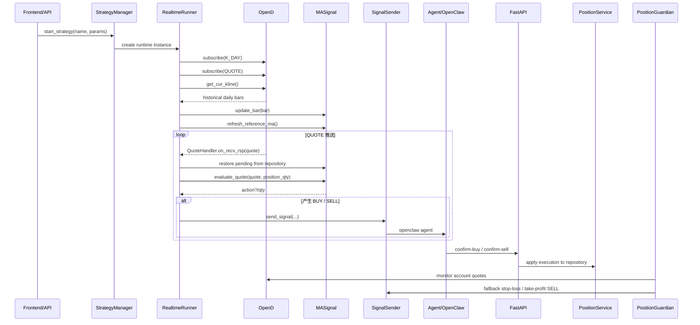
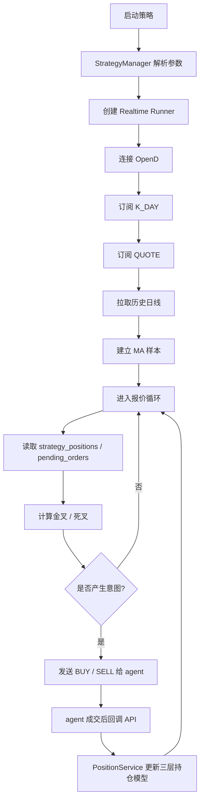

# 策略管理与运行架构设计

## 1. 文档范围

本文档描述当前代码库中的策略管理、实时运行、成交确认、账户级风控与回测复用设计。

核心实现文件：

- `/Users/mubinlai/code/quant-trading-system/backend/api/app.py`
- `/Users/mubinlai/code/quant-trading-system/backend/services/strategy_manager.py`
- `/Users/mubinlai/code/quant-trading-system/backend/services/position_service.py`
- `/Users/mubinlai/code/quant-trading-system/backend/strategies/signals/ma_signal.py`
- `/Users/mubinlai/code/quant-trading-system/backend/strategies/runtime/realtime_runner.py`
- `/Users/mubinlai/code/quant-trading-system/backend/monitoring/guardian.py`
- `/Users/mubinlai/code/quant-trading-system/backend/repositories/runtime_repository.py`

## 2. 设计目标

当前设计主要解决以下问题：

1. 将行情接入、策略判断、信号发送、成交确认解耦。
2. 让同一套信号逻辑同时服务于实时运行和回测。
3. 将“交易意图”和“成交事实”分离，避免未成交订单被误登记为持仓。
4. 将持仓事实统一收敛到数据库，避免主进程和子进程分别维护两套账。
5. 将兜底风控从策略子进程剥离，使策略停止后已有仓位仍可持续监控。

## 3. 总体架构



核心原则：

- 策略运行在子进程。
- 成交确认统一在主进程处理。
- SQLite 是跨进程共享状态源。
- 子进程只保留高频热状态，不再作为持仓事实来源。

## 4. 模块职责

### 4.1 StrategyManager

文件：
- `/Users/mubinlai/code/quant-trading-system/backend/services/strategy_manager.py`

职责：

1. 注册可用策略。
2. 管理策略元数据。
3. 创建实时运行实例。
4. 创建回测使用的纯信号实例。

关键设计：

- `STRATEGY_REGISTRY` 同时维护：
  - `runtime_class`
  - `signal_class`
- `STRATEGY_METADATA` 供前端和 API 展示策略说明与默认参数。

### 4.2 纯信号层

文件：
- `/Users/mubinlai/code/quant-trading-system/backend/strategies/signals/ma_signal.py`

职责：

1. 维护历史日线样本。
2. 按 `time_key` 去重更新 bar。
3. 计算短期 / 长期 MA。
4. 依据当前持仓数量与 pending 状态生成 `BUY` / `SELL` 意图。
5. 从数据库恢复 `pending_orders` 对应的运行态。

不负责：

1. OpenD 连接。
2. API 调用。
3. Agent 发送。
4. 成交落账。

核心热状态：

- `prices[code]`
- `bar_time_keys[code]`
- `last_short_ma[code]`
- `last_long_ma[code]`
- `pending_buys`
- `pending_sells`

### 4.3 实时运行适配层

文件：
- `/Users/mubinlai/code/quant-trading-system/backend/strategies/runtime/realtime_runner.py`

职责：

1. 连接 OpenD。
2. 订阅 `K_DAY` 和 `QUOTE`。
3. 初始化历史日线样本。
4. 将报价回调转交给 `ma_signal`。
5. 发出标准化 `BUY` / `SELL` 意图给 agent。
6. 从数据库读取：
   - `strategy_positions`
   - `pending_orders`

说明：

- 运行器不再负责正式成交落账。
- `confirm_position()` / `confirm_exit()` 仅保留给兼容测试和极简离线场景。

### 4.4 PositionService

文件：
- `/Users/mubinlai/code/quant-trading-system/backend/services/position_service.py`

职责：

1. 处理 `confirm-buy` / `confirm-sell`。
2. 将一笔成交事实同时投影到三层数据模型：
   - `executions`
   - `strategy_positions`
   - `account_positions`
3. 清理对应 `pending_orders`。

这是当前架构下的唯一正式落账入口。

### 4.5 PositionGuardian

文件：
- `/Users/mubinlai/code/quant-trading-system/backend/monitoring/guardian.py`

职责：

1. 常驻于 FastAPI 主进程。
2. 持续读取 `account_positions`。
3. 统一订阅账户级持仓标的报价。
4. 触发固定 `-20%` 止损和 `+30%` 止盈兜底卖出。

说明：

- 策略停止后，`guardian` 仍会继续监控账户级仓位。
- `position_monitor.py` 仅保留为兼容 / 本地测试路径，不是正式持仓事实来源。

### 4.6 Signal Sender

文件：
- `/Users/mubinlai/code/quant-trading-system/backend/integrations/agent/signal_sender.py`

职责：

1. 统一封装交易信号。
2. 调用 `openclaw agent`。
3. 记录发送日志。

它不关心策略细节，只关心如何将标准信号发给外部执行层。

### 4.7 Repository 层

文件：
- `/Users/mubinlai/code/quant-trading-system/backend/repositories/runtime_repository.py`
- `/Users/mubinlai/code/quant-trading-system/backend/repositories/sqlite.py`

职责：

1. 持久化运行实例。
2. 持久化策略归属持仓。
3. 持久化账户级持仓。
4. 持久化待确认订单。
5. 持久化逐笔成交流水。
6. 为主进程、guardian 和策略子进程提供共享状态源。

## 5. OpenD API 接入设计

OpenD 相关逻辑集中在：

- `/Users/mubinlai/code/quant-trading-system/backend/strategies/runtime/realtime_runner.py`
- `/Users/mubinlai/code/quant-trading-system/backend/monitoring/guardian.py`

### 5.1 Realtime Runner

实时策略启动时：

1. 建立 `OpenQuoteContext(host, port)`
2. 注册 `StockQuoteHandlerBase` 子类
3. 订阅：
   - `SubType.K_DAY`
   - `SubType.QUOTE`
4. 通过：

```python
get_cur_kline(code, long_ma_period + 5, KLType.K_DAY)
```

初始化历史样本。

策略实时判断方式为：

1. 历史日线作为 MA 样本基础。
2. 用最新报价替换最后一根日线收盘价。
3. 计算盘中的短期 / 长期 MA。

即：

- `日线 MA + QUOTE 实时判断`

### 5.2 PositionGuardian

guardian 独立订阅 `account_positions` 中涉及的标的报价。

它不参与策略判断，只做账户级止损止盈兜底。

## 6. 数据模型

当前模型分为三层：

### 6.1 executions

逐笔成交流水。

用途：

- 审计
- 复盘
- 已实现盈亏记录

### 6.2 strategy_positions

按 `run_id + code` 维护的策略归属持仓。

用途：

- 策略归因
- 策略维度状态恢复
- 判断某个策略实例当前是否已有仓位

### 6.3 account_positions

按 `account_id + code` 维护的账户级聚合持仓。

用途：

- 账户级风控
- guardian 统一监控
- 前端展示真实总仓位

设计含义：

- 同一标的可由多个策略实例分别持有。
- 同时这些仓位会聚合到账户级总仓位。

## 7. 成交确认链路

成交确认不再通过子进程命令队列完成。

当前链路为：



这意味着：

- API 不写子进程内存。
- 子进程也不再消费成交确认命令。
- 数据库是唯一正式持仓事实来源。

## 8. 实时运行时序图



## 9. 启动流程图



## 10. 当前优点

1. 实时与回测共享同一套信号层。
2. 成交事实只由主进程落账，状态收敛更清晰。
3. 策略停止后已有仓位仍由 guardian 托管。
4. 同时保留策略归属视图和账户级总仓位视图。

## 11. 当前局限

1. `position_monitor.py` 仍保留兼容路径，语义上容易与 guardian 混淆。
2. guardian 当前按账户级总仓位发兜底 SELL，后续如需更细分配，需要补策略归属分摊规则。
3. FastAPI 仍使用 `@app.on_event`，后续可迁移到 lifespan。
