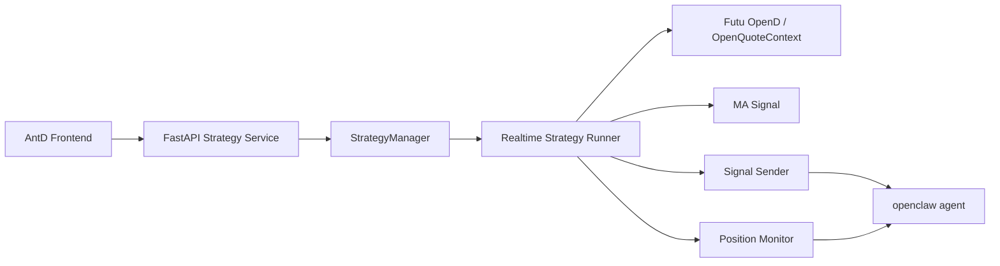
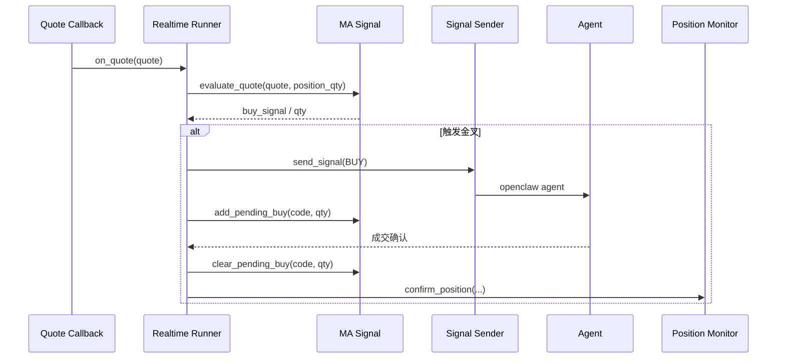
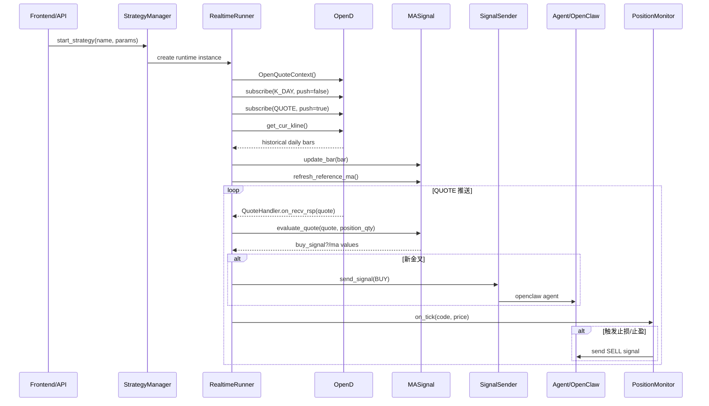
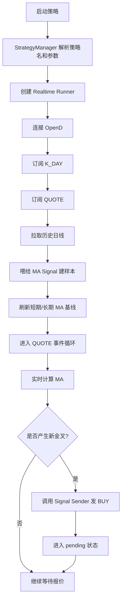

# 策略管理与运行架构设计

## 1. 文档范围

本文档描述当前代码库中的策略管理、实时运行、信号发送、持仓监控与回测复用设计。

文档基于以下实现文件：

- `/Users/mubinlai/code/quant-trading-system/backend/services/strategy_manager.py`
- `/Users/mubinlai/code/quant-trading-system/backend/strategies/signals/ma_signal.py`
- `/Users/mubinlai/code/quant-trading-system/backend/strategies/runtime/base.py`
- `/Users/mubinlai/code/quant-trading-system/backend/integrations/agent/signal_sender.py`
- `/Users/mubinlai/code/quant-trading-system/backend/monitoring/position_monitor.py`
- `/Users/mubinlai/code/quant-trading-system/backend/api/app.py`

本文档描述的是当前实现，不是理想化方案。

## 2. 设计目标

当前设计主要解决三个问题：

1. 将 API 接入、策略判断、信号发送拆开，避免强耦合。
2. 让同一套策略逻辑既能用于实时运行，也能用于历史回测。
3. 将“发出买入意图”和“成交后登记持仓”分离，避免未成交单被误记为持仓。

## 3. 总体架构



## 4. 模块职责

### 4.1 StrategyManager

文件：
- `/Users/mubinlai/code/quant-trading-system/backend/services/strategy_manager.py`

职责：

1. 注册可用策略。
2. 管理策略元数据。
3. 根据策略名和参数创建实时策略实例。
4. 根据策略名和参数创建纯信号实例。

核心设计：

- `STRATEGY_REGISTRY` 同时注册两类实现：
  - `runtime_class`
  - `signal_class`
- `STRATEGY_METADATA` 用于前端展示和默认参数管理。

当前已注册策略：

- `single_position_ma`
- `pyramiding_ma`

### 4.2 纯信号层

文件：
- `/Users/mubinlai/code/quant-trading-system/backend/strategies/signals/ma_signal.py`

职责：

1. 维护历史 K 线收盘价样本。
2. 根据 `time_key` 去重并更新样本。
3. 计算短期/长期 MA。
4. 根据持仓模型判断是否产生 BUY 信号。

不负责：

1. OpenD 连接。
2. 行情订阅。
3. OpenClaw 调用。
4. 持仓登记和止损止盈执行。

核心状态：

- `prices[code]`：历史收盘价样本。
- `bar_time_keys[code]`：用于按 `time_key` 去重。
- `last_short_ma / last_long_ma`：上次参考均线值。
- `pending_buys`：待确认买单状态。

### 4.3 实时运行适配层

文件：
- `/Users/mubinlai/code/quant-trading-system/backend/strategies/runtime/base.py`

职责：

1. 连接 OpenD。
2. 订阅日 K 和实时报价。
3. 初始化历史日线数据。
4. 将报价回调转成对纯信号层的调用。
5. 将 BUY 信号转交给 `signal_sender`。
6. 将成交确认后的持仓交给 `position_monitor`。

这里是策略与外部世界之间的桥接层。

### 4.4 Signal Sender

文件：
- `/Users/mubinlai/code/quant-trading-system/backend/integrations/agent/signal_sender.py`

职责：

1. 统一构造交易信号消息。
2. 调用 `openclaw agent`。
3. 记录发送日志。

它不关心均线策略细节，只关心收到一个标准化交易信号后如何发送。

### 4.5 Position Monitor

文件：
- `/Users/mubinlai/code/quant-trading-system/backend/monitoring/position_monitor.py`

职责：

1. 保存已成交持仓。
2. 支持累计加仓后的加权均价。
3. 在行情更新时检查止损/止盈。
4. 触发卖出时发送 SELL 信号。

它不负责决定什么时候买入，只负责管理已经确认成交的仓位。

### 4.6 后台服务

文件：
- `/Users/mubinlai/code/quant-trading-system/backend/app.py`

职责：

1. 提供策略列表接口。
2. 提供启动和停止策略接口。
3. 以子进程方式托管策略运行。
4. 收集并暴露日志。

后台服务不在主进程里直接执行策略逻辑，而是通过 `subprocess.Popen` 启动策略脚本。

## 5. API 接入设计

实时行情接入全部集中在：

- `/Users/mubinlai/code/quant-trading-system/backend/strategies/runtime/base.py`

当前主要使用了以下 Futu OpenD API：

### 5.1 建立行情上下文

通过：

```python
OpenQuoteContext(host=host, port=port)
```

建立本地到 OpenD 的连接。

### 5.2 注册报价回调

通过：

```python
quote_ctx.set_handler(self.quote_handler)
```

注册 `StockQuoteHandlerBase` 子类。

收到推送后，`QuoteHandler.on_recv_rsp()` 会把每条报价继续传给：

```python
self.strategy.on_quote(quote)
```

### 5.3 订阅数据

当前实时策略启动时会做两类订阅：

1. `SubType.K_DAY`
   - 用途：保证可以初始化日线数据。
   - 设置为 `subscribe_push=False`，不依赖日 K 推送驱动策略。

2. `SubType.QUOTE`
   - 用途：持续接收报价回调。
   - 实时策略的盘中判断依赖这个推送。

### 5.4 初始化历史日线

启动后调用：

```python
get_cur_kline(code, long_ma_period + 5, KLType.K_DAY)
```

用途：

1. 获取足够的历史日线样本。
2. 构建初始 `prices` 序列。
3. 刷新短期/长期 MA 基准值。

### 5.5 实时计算方式

当前策略不是分钟 K 驱动，而是：

1. 用历史日线作为 MA 样本基础。
2. 用最新 `QUOTE.last_price` 替换最后一根日线的收盘价。
3. 计算盘中的“实时短期 MA / 实时长期 MA”。

这样实现的是：

- `日线 MA + QUOTE 实时判断`

而不是：

- `分钟 K 策略`

## 6. 策略实现设计

### 6.1 数据更新

纯信号层通过 `update_bar(bar_data)` 维护样本。

去重规则：

1. 如果 `time_key` 不同，追加一条新 bar。
2. 如果 `time_key` 相同，更新最后一条价格。

这样避免了以前按 `close_price` 去重带来的错误。

### 6.2 实时报价评估

纯信号层通过 `evaluate_quote(quote_data, position_qty)` 评估买入意图。

核心流程：

1. 样本不足长期均线周期时，不评估。
2. 计算实时短期/长期 MA。
3. 用 `last_short_ma / last_long_ma` 与当前值比较。
4. 满足金叉条件才产生 BUY 意图。

当前买入判定为：

```python
if prev_short_ma <= prev_long_ma and short_ma > long_ma:
```

这意味着当前策略是“事件驱动的金叉买入”，不是“只要均线多头排列就买入”。

### 6.3 两种仓位模型

#### 单仓模型

类：
- `SinglePositionMaSignal`

规则：

1. 同一标的同一时间只允许一笔正式持仓。
2. 同一标的只允许一个 pending BUY。

#### 有上限加仓模型

类：
- `PyramidingMaSignal`

规则：

1. 允许继续 BUY。
2. 但 `当前已持仓数量 + 待确认数量 + 本次买入数量` 不能超过上限。

## 7. 信号发送与持仓监控解耦

这是当前设计的核心。

### 7.1 解耦前的问题

如果策略在发出 BUY 时立刻登记持仓，会出现：

1. 订单未成交却被当作持仓。
2. 成交失败后风控状态错误。
3. 执行层与策略层强耦合。

### 7.2 当前解耦方式

当前 BUY 链路分成三段：

1. `MA Signal`
   - 只判断是否应当发 BUY。

2. `Realtime Runner`
   - 只负责把 BUY 意图转换为一次发送动作。
   - 同时把标的记为 `pending`。

3. 外部执行回报
   - 成交后再调用 `confirm_position(...)`。
   - 这时才进入 `PositionMonitor`。

因此：

- BUY 信号不等于已持仓。
- 持仓状态以成交确认结果为准。

### 7.3 BUY 流程



### 7.4 SELL 流程

SELL 不是由均线策略直接触发，而是由持仓监控模块触发。

流程：

1. 报价进入 `Realtime Runner`
2. `Realtime Runner` 调用 `monitor.on_tick(code, price)`
3. 如果触发止损或止盈
4. `PositionMonitor` 发送 SELL 信号
5. 持仓从监控器中移除

这意味着：

- 买入逻辑和卖出风控逻辑分开维护
- 均线策略不直接处理出场规则

## 8. 实时运行时序图



## 9. 启动流程图



## 10. 后台服务运行模型

后台服务使用子进程托管策略，不把策略主循环直接塞进 FastAPI 线程。

原因：

1. 长循环策略与 Web 请求生命周期不同。
2. 子进程隔离后，单个策略崩溃不会直接影响 API 服务。
3. 日志可以天然按运行实例落到单独文件。

当前实现方式：

1. `POST /api/runs`
2. 构造 `python3 -m backend.cli.run_strategy ...`
3. 用 `subprocess.Popen(...)` 启动
4. 输出重定向到 `backend/logs/<run_id>.log`
5. 前端通过日志接口读取尾部内容

## 11. 当前设计的优点

### 11.1 策略复用性更好

实时与回测共享 `signal_class`，避免重复写一套均线逻辑。

### 11.2 OpenD 依赖边界清晰

OpenD 相关代码集中在 `Realtime Runner`，不会污染策略判断层。

### 11.3 发送通道可替换

如果未来不再使用 `openclaw agent`，只需要替换 agent 对接层实现。

### 11.4 成交与持仓状态一致

当前设计避免了“发 BUY 即登记仓位”的错误状态。

## 12. 当前局限

目前仍有这些限制：

1. `confirm_position(...)` 还未接入正式的成交回报链路，需要外部调用。
2. `PositionMonitor` 仍是进程内存状态，没有持久化。
3. agent 对接层仍保留 `TEST_MODE`。
4. 启动后如果已经是多头状态，不会补发 BUY，因为当前采用的是“新金叉事件”模型。
5. 回测与实时虽然共用信号层，但执行与持仓模型仍可以继续抽象。

## 13. 后续建议

建议的下一步演进方向：

1. 增加正式的成交确认回调接口，将 `confirm_position(...)` 接入后台服务。
2. 将持仓、pending、运行参数持久化。
3. 继续扩展 agent 对接层为统一执行网关接口。
4. 把实时数据接入层继续抽象为 `MarketDataAdapter`，为未来替换行情源做准备。
