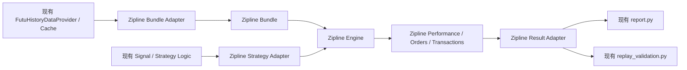

# Zipline 对接设计文档

## 1. 文档目标

本文档描述如何在**不破坏现有实时交易架构**的前提下，把 Zipline 接入当前项目，作为一个可插拔的专业回测后端。

目标不是让 Zipline 替代整个系统，而是：

- 为 `daily / minute` 策略提供一个更成熟的回测后端选项
- 保留现有 `native` 回测引擎与 `tick` 路径
- 保留现有 `report.py` 与 `replay_validation.py`
- 让 Zipline 输出最终仍能接回当前项目的统一结果格式

## 2. 当前架构前提

当前项目已经具备：

- 统一的 `signal / strategy logic`
- 原生回测引擎：
  - `daily`
  - `minute`
  - `tick`
- OpenD 历史数据拉取与本地缓存
- 回测结果回放验证链路

对应文件：

- [/Users/mubinlai/code/quant-trading-system/backtest/data_provider.py](/Users/mubinlai/code/quant-trading-system/backtest/data_provider.py)
- [/Users/mubinlai/code/quant-trading-system/backtest/engine.py](/Users/mubinlai/code/quant-trading-system/backtest/engine.py)
- [/Users/mubinlai/code/quant-trading-system/backtest/report.py](/Users/mubinlai/code/quant-trading-system/backtest/report.py)
- [/Users/mubinlai/code/quant-trading-system/backtest/replay_validation.py](/Users/mubinlai/code/quant-trading-system/backtest/replay_validation.py)
- [/Users/mubinlai/code/quant-trading-system/backend/services/strategy_manager.py](/Users/mubinlai/code/quant-trading-system/backend/services/strategy_manager.py)

因此 Zipline 的正确位置，不是“替换整个回测模块”，而是：

- 替换或增强 `daily / minute` 的**引擎层**
- 不碰实时交易层
- 不碰主进程订单/成交/持仓落账模型

## 3. 总体定位

Zipline 在当前系统中的定位应当是：

- `可选的专业回测 backend`

而不是：

- `整个系统的统一执行与账本核心`

更直接地说：

- 实时交易：继续用你当前架构
- 日线/分钟回测：可选 `native` 或 `zipline`
- tick 回测：继续用当前原生引擎

## 4. 为什么不能直接替换现有架构

原因有四个。

### 4.1 实时交易与 Zipline 语义不同

当前实时链路是：

- OpenD 行情
- 策略子进程
- `agent` 或 `direct` 执行
- 主进程成交落账

Zipline 不是实时执行框架，它更适合作为离线回测引擎。

### 4.2 当前项目已有自己的业务账本

项目已明确区分：

- `trade_orders`
- `trade_deals`
- `executions`
- `strategy_positions`
- `account_positions`

Zipline 不应该取代这套业务账本。

### 4.3 当前 signal 接口与 Zipline 算法接口不同

当前 signal 层主要是：

- `update_bar(...)`
- `evaluate_quote(...)`

Zipline 的算法入口则通常是：

- `initialize(context)`
- `handle_data(context, data)`

两者不是直接兼容，需要适配层。

### 4.4 tick 路径不适合 Zipline

当前项目已经有自己的 `tick` 假设引擎。

Zipline 更适合：

- `daily`
- `minute`

不适合成为你当前 `tick` 路径的统一替代。

## 5. 推荐对接策略

推荐采用：

- `双引擎并存`

也就是：

- 保留 `native` 引擎
- 新增 `zipline` backend

运行时可选：

- `--backtest-backend native`
- `--backtest-backend zipline`

## 6. 技术对接流程图

这张图表达的是：

- 数据仍然由当前项目拉取和缓存
- 策略逻辑仍然由当前项目维护
- Zipline 只负责 `daily / minute` 回测执行
- 输出最后仍收敛回当前项目的报表和回放验证体系

## 7. 分层对接方案

## 7.1 数据层：Zipline Bundle Adapter

### 目标

把当前 `data_provider.py` 拉下来的历史数据，转换成 Zipline bundle 所需格式。

### 原则

不要让 Zipline 自己去直接拉 Futu。

正确做法是：

- 继续由当前项目的 `FutuHistoryDataProvider` 拉历史数据
- 继续复用本地 cache
- 由一个 adapter 把这些数据写成 Zipline bundle

### 建议新增文件

- [/Users/mubinlai/code/quant-trading-system/backtest/zipline_bundle.py](/Users/mubinlai/code/quant-trading-system/backtest/zipline_bundle.py)

### 主要职责

1. 读取当前项目缓存或数据提供器返回的 DataFrame
2. 生成 Zipline 所需资产元数据
3. 写入：
   - `asset_db`
   - `daily_bar_writer`
   - `minute_bar_writer`
   - `adjustment_writer`
4. 注册并命名 bundle

### 边界

- `daily` 和 `minute` 可接入
- `tick` 不接 bundle

## 7.2 策略层：Zipline Strategy Adapter

### 目标

复用现有 signal / strategy logic，而不是重写一套 Zipline 专用策略。

### 建议新增文件

- [/Users/mubinlai/code/quant-trading-system/backtest/zipline_strategy_adapter.py](/Users/mubinlai/code/quant-trading-system/backtest/zipline_strategy_adapter.py)

### 主要职责

1. 在 `handle_data()` 中读取 Zipline 当前 bar
2. 构造当前 signal 所需的 payload
3. 调用：
   - `signal.update_bar(...)`
   - `signal.evaluate_quote(...)`
4. 把 signal 的结果映射成 Zipline 下单动作

### 注意点

适合先接的策略：

- `single_position_ma`
- `pyramiding_ma`
- `rsi_reversion`
- `bollinger_reversion`
- `macd_trend`
- `donchian_breakout`
- `intraday_breakout_test` 的分钟模式

## 7.3 引擎层：Zipline Runner

### 目标

把 Zipline 作为当前回测框架中的一个 backend。

### 建议新增文件

- [/Users/mubinlai/code/quant-trading-system/backtest/zipline_runner.py](/Users/mubinlai/code/quant-trading-system/backtest/zipline_runner.py)

### 主要职责

1. 解析当前项目回测参数
2. 选择 bundle、calendar、时间范围
3. 调用 Zipline backtest
4. 返回 Zipline 原始结果对象

### 与当前 CLI 的关系

在以下入口增加 backend 选择：

- [/Users/mubinlai/code/quant-trading-system/backtest/run_backtest.py](/Users/mubinlai/code/quant-trading-system/backtest/run_backtest.py)
- [/Users/mubinlai/code/quant-trading-system/backtest/replay_validation.py](/Users/mubinlai/code/quant-trading-system/backtest/replay_validation.py)

新增参数建议：

- `--backtest-backend native`
- `--backtest-backend zipline`

## 7.4 结果层：Zipline Result Adapter

### 目标

不要让 Zipline 输出直接成为项目最终接口，而是适配成当前项目已有的统一结果格式。

### 建议新增文件

- [/Users/mubinlai/code/quant-trading-system/backtest/zipline_result_adapter.py](/Users/mubinlai/code/quant-trading-system/backtest/zipline_result_adapter.py)

### 主要职责

把 Zipline 输出适配成当前项目所需结构，例如：

- `summary`
- `equity_curve`
- `trades`
- `open_positions`
- `orders`
- `transactions`

这样可继续复用：

- [/Users/mubinlai/code/quant-trading-system/backtest/report.py](/Users/mubinlai/code/quant-trading-system/backtest/report.py)
- [/Users/mubinlai/code/quant-trading-system/backtest/replay_validation.py](/Users/mubinlai/code/quant-trading-system/backtest/replay_validation.py)

## 8. 与现有模块的映射关系

| 当前模块 | Zipline 对接后的角色 |
| --- | --- |
| `backtest/data_provider.py` | 历史数据标准来源 |
| `backtest/engine.py` | `native` backend |
| `backtest/portfolio.py` | `native` backend 账户模型 |
| `backtest/report.py` | 统一报告层 |
| `backtest/replay_validation.py` | 统一业务流程验证层 |
| `backend/services/strategy_manager.py` | 策略注册与 metadata 中心 |

Zipline 不应碰这些边界：

- 实时子进程运行模型
- 主进程 `PositionService`
- 主进程 `trade_orders / trade_deals / positions` 业务账本

## 9. HK 市场日历设计

这是 Zipline 对接里必须单独处理的一层。

原因：

- 当前项目大量使用 `HK.03690`
- 日内策略依赖 session 语义
- 分钟线回测如果交易日历不准，会直接影响：
  - 开盘/收盘判断
  - `entry_start_time`
  - `flat_time`
  - 日内切日逻辑

### 建议

1. 明确 HKEX 交易日历
2. 如现成 calendar 不符合项目需求，则注册 custom calendar
3. 在 Zipline backend 中强制将港股策略与 HK calendar 绑定

## 10. 与当前实盘模型的收敛方式

Zipline 进入系统后，建议保持以下原则：

### 回测与实盘共享

- 策略 signal / logic
- 策略参数 metadata
- 回测结果回放验证

### 回测与实盘不共享

- 实时订单执行器
- 主进程成交回报处理
- 实盘持仓账本

这意味着：

- Zipline 用于研究与回测
- 当前主进程架构继续用于真实交易

## 11. 推荐实施顺序

建议分四步做。

### 第一步

先实现：

- `zipline_bundle.py`

目标：

- 证明当前 OpenD 历史数据可以稳定落成 Zipline bundle

### 第二步

再实现：

- `zipline_strategy_adapter.py`
- `zipline_runner.py`

目标：

- 跑通一条最简单策略，例如 `single_position_ma`

### 第三步

再实现：

- `zipline_result_adapter.py`

目标：

- 将 Zipline 输出收敛成当前项目统一结果格式

### 第四步

最后才把：

- `replay_validation.py`

接到 Zipline 结果上，完成：

- `Zipline 回测 -> 当前业务流程回放验证`

## 12. 适合先接入 Zipline 的策略

建议优先级如下。

### 第一批

- `single_position_ma`
- `pyramiding_ma`
- `rsi_reversion`
- `bollinger_reversion`
- `macd_trend`
- `donchian_breakout`

原因：

- 全部都是标准 `bar-based` 策略
- 无需复杂 tick 语义

### 第二批

- `intraday_breakout_test`

原因：

- 依赖分钟级 session 语义
- 但仍可在 Zipline minute 模式下接入

### 不建议接入

- 任何强依赖 tick 的策略
- 未来若有逐笔成交、盘口、L2 策略，也不建议优先走 Zipline

## 13. 最终建议

针对当前项目，最稳妥的方案不是“让 Zipline 接管回测模块”，而是：

- 保留现有 `native` 引擎
- 新增 `zipline` backend
- 让 `daily / minute` 策略可以按需选择
- 保留 `tick` 原生引擎
- 最终输出统一适配回当前项目自己的 `report / replay_validation`

一句话总结：

**Zipline 应该接在当前项目的回测引擎层，而不是接进实时交易架构。**
